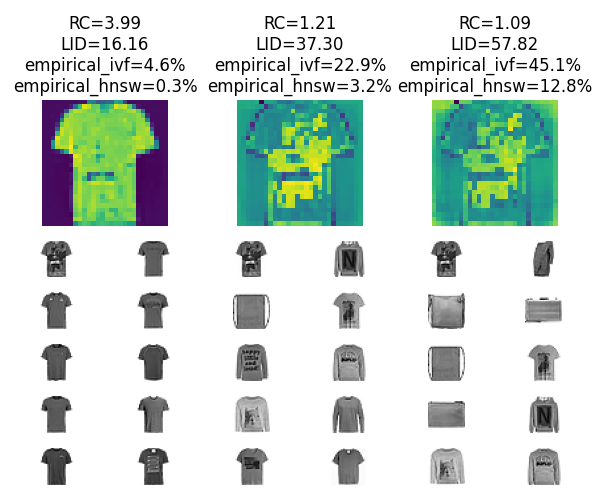

# Hephaestus

Like the Greek god of artisans and blacksmiths forged the weapons of gods,
this software forges workloads for approximate nearest neighbor search algorithms.

## What does it do?

Consider the classic [fashion-mnist](https://github.com/zalandoresearch/fashion-mnist) dataset
(which can also be downloaded in HDF5 format from [ann-benchmarks](http://ann-benchmarks.com/fashion-mnist-784-euclidean.hdf5)).
It contains 28x28 images of apparel items, that can be compared by the Euclidean distance.

Using `hephaestus.py`, we can create three queries with different levels of difficulty
(more on this below):

The top row of plots reports the synthesized queries, from left to right the grow more difficult to answer.
The tiny gray images below each query report the 10 nearest neighbors of each query. You can see that
more difficult queries have a more diversified set of answers.

## How is difficulty measured?

We consider two different ways of measuring difficulty: _explicative_ difficulty measures try to capture
the geometric relationship between a query and the dataset, while _empirical_ difficulty measures capture the
effort invested by an index data structure to answer a query.

